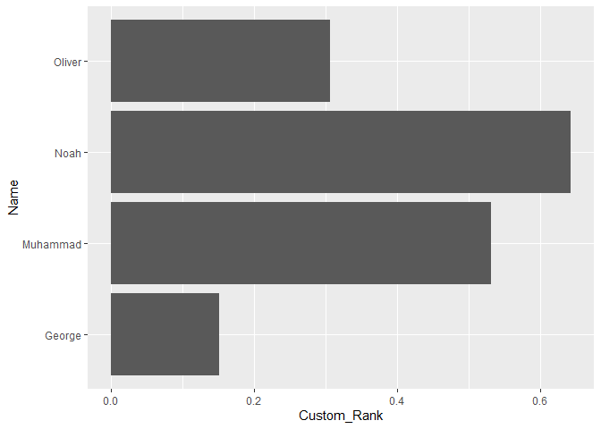
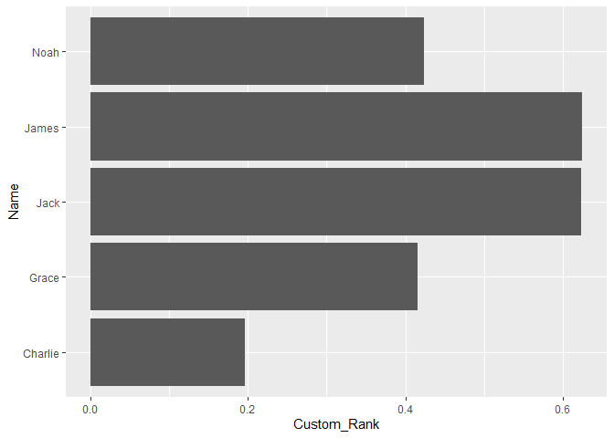
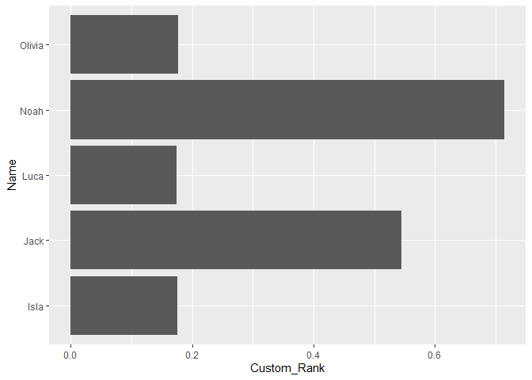
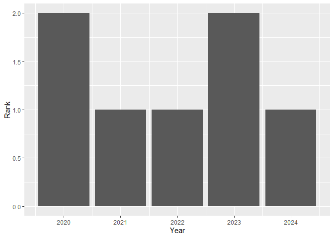
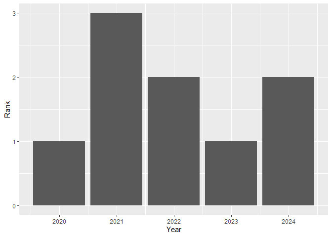
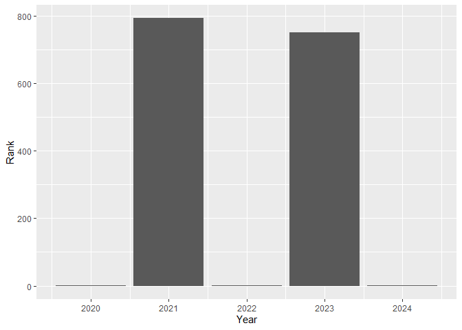
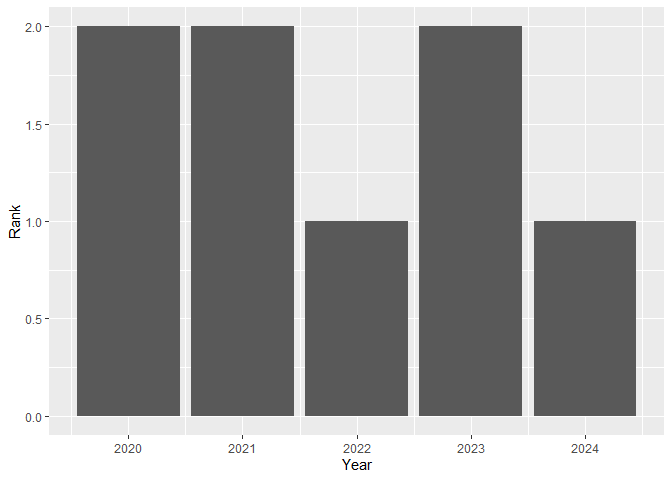

TidyTuesday June 16, 2026
================

## Hello!

This is my **first** time working with Tidy Tuesday data. I’m a
beginning student in a Master’s in Data Science program. Wish me luck!🍀

### Load the necessary packages

``` r
# Load packages
library(tidyverse)
library(knitr)
```

### Load the data

``` r
# Load the data
eng_wales <- read_csv("16Jun2026 data/raw_england_wales_names.csv")
```

    ## Rows: 349987 Columns: 5
    ## ── Column specification ────────────────────────────────────────────────────────
    ## Delimiter: ","
    ## chr (2): Sex, Name
    ## dbl (3): Year, Number, Rank
    ## 
    ## ℹ Use `spec()` to retrieve the full column specification for this data.
    ## ℹ Specify the column types or set `show_col_types = FALSE` to quiet this message.

``` r
nor_ire <- read_csv("16Jun2026 data/raw_ni_names.csv")
```

    ## Rows: 120756 Columns: 5
    ## ── Column specification ────────────────────────────────────────────────────────
    ## Delimiter: ","
    ## chr (2): Sex, Name
    ## dbl (3): Year, Number, Rank
    ## 
    ## ℹ Use `spec()` to retrieve the full column specification for this data.
    ## ℹ Specify the column types or set `show_col_types = FALSE` to quiet this message.

``` r
scot <- read_csv("16Jun2026 data/raw_scotland_names.csv")
```

    ## Rows: 74331 Columns: 5
    ## ── Column specification ────────────────────────────────────────────────────────
    ## Delimiter: ","
    ## chr (2): Sex, Name
    ## dbl (3): Year, Number, Rank
    ## 
    ## ℹ Use `spec()` to retrieve the full column specification for this data.
    ## ℹ Specify the column types or set `show_col_types = FALSE` to quiet this message.

## Data analysis

### What’s in the data?

``` r
# Find range of years in each dataset
print("Range for England_Wales:")
```

    ## [1] "Range for England_Wales:"

``` r
range(eng_wales$Year, na.rm = TRUE)
```

    ## [1] 1996 2024

``` r
print("Range for North_Ireland")
```

    ## [1] "Range for North_Ireland"

``` r
range(nor_ire$Year, na.rm = TRUE)
```

    ## [1] 1997 2025

``` r
print("Range for Scotland")
```

    ## [1] "Range for Scotland"

``` r
range(scot$Year, na.rm = TRUE)
```

    ## [1] 1974 2025

A quick glance at the data shows they do not share the same time frame.
The English_Wales dataset includes years from 1996-2024. The
North_Ireland dataset includes years from 1997-2025. The Scotland
dataset includes years from 1997-2025. Let’s limit the data to a 5-year
window between 2020 and 2024.

``` r
eng_wales5 <- filter(eng_wales, Year >= 2020 & Year <= 2024)
nor_ire5 <- filter(nor_ire, Year >= 2020 & Year <= 2024)
scot5 <- filter(scot, Year >= 2020 & Year <= 2024)

# Get the overall summary of each dataset
print("English_Wales Data Summary:")
```

    ## [1] "English_Wales Data Summary:"

``` r
summary(eng_wales5)
```

    ##       Year          Sex                Name               Number       
    ##  Min.   :2020   Length:68323       Length:68323       Min.   :   3.00  
    ##  1st Qu.:2021   Class :character   Class :character   1st Qu.:   4.00  
    ##  Median :2022   Mode  :character   Mode  :character   Median :   6.00  
    ##  Mean   :2022                                         Mean   :  40.15  
    ##  3rd Qu.:2023                                         3rd Qu.:  16.00  
    ##  Max.   :2024                                         Max.   :5721.00  
    ##       Rank     
    ##  Min.   :   1  
    ##  1st Qu.:1685  
    ##  Median :3219  
    ##  Mean   :3130  
    ##  3rd Qu.:4646  
    ##  Max.   :5892

``` r
print("North_Ireland Data Summary:")
```

    ## [1] "North_Ireland Data Summary:"

``` r
summary(nor_ire5)
```

    ##       Year          Sex                Name               Number      
    ##  Min.   :2020   Length:20820       Length:20820       Min.   :  3.00  
    ##  1st Qu.:2021   Class :character   Class :character   1st Qu.:  4.00  
    ##  Median :2022   Mode  :character   Mode  :character   Median :  7.00  
    ##  Mean   :2022                                         Mean   : 16.56  
    ##  3rd Qu.:2023                                         3rd Qu.: 18.00  
    ##  Max.   :2024                                         Max.   :193.00  
    ##                                                       NA's   :15618   
    ##       Rank      
    ##  Min.   :  1    
    ##  1st Qu.:127    
    ##  Median :249    
    ##  Mean   :240    
    ##  3rd Qu.:350    
    ##  Max.   :446    
    ##  NA's   :15618

``` r
print("Scotland Data Summary:")
```

    ## [1] "Scotland Data Summary:"

``` r
summary(scot5)
```

    ##       Year          Sex                Name               Number      
    ##  Min.   :2020   Length:9491        Length:9491        Min.   :  3.00  
    ##  1st Qu.:2021   Class :character   Class :character   1st Qu.:  4.00  
    ##  Median :2022   Mode  :character   Mode  :character   Median :  7.00  
    ##  Mean   :2022                                         Mean   : 20.84  
    ##  3rd Qu.:2023                                         3rd Qu.: 17.00  
    ##  Max.   :2024                                         Max.   :382.00  
    ##       Rank      
    ##  Min.   :  1.0  
    ##  1st Qu.:233.0  
    ##  Median :442.0  
    ##  Mean   :436.5  
    ##  3rd Qu.:636.0  
    ##  Max.   :792.0

``` r
# Remove NA values in nor_ire5 dataset
nor_ire5 <- nor_ire5 %>% drop_na()

# Verifying NAs were dropped
nrow(nor_ire5)
```

    ## [1] 5202

``` r
# Get the total number of names for each dataset
total_ew <- sum(eng_wales5$Number)
total_ni <- sum(nor_ire5$Number)
total_s <- sum(scot5$Number)

# Create a new column in each data set that holds a custom-calculated ranking
eng_wales5 <- eng_wales5 %>% mutate(Custom_Rank = (Number / total_ew) * 100)
nor_ire5 <- nor_ire5 %>% mutate(Custom_Rank = (Number / total_ni) * 100)
scot5 <- scot5 %>% mutate(Custom_Rank = (Number / total_s) * 100)
```

### Let’s try some plots…

``` r
# Plot the top 10 baby names using a column chart
eng_wales5 %>% slice_max(Custom_Rank, n = 10) %>% ggplot(aes(x = Custom_Rank, y = Name)) + geom_col()
```

<!-- -->

``` r
# Plot the top 10 baby names using a column chart
nor_ire5 %>% slice_max(Custom_Rank, n = 10) %>% ggplot(aes(x = Custom_Rank, y = Name)) + geom_col()
```

<!-- -->

``` r
# Plot the top 10 baby names using a column chart
scot5 %>% slice_max(Custom_Rank, n = 10) %>% ggplot(aes(x = Custom_Rank, y = Name)) + geom_col()
```

<!-- -->

It’s **interesting** that the only dataset that has girl names in the
top 10 ranking is Scotland. Is it possible that there were more girls
born in Scotland than the other two regions?

### Check 👦 vs 👧 babies born in the 5-year time frame for each region

``` r
# Find England_Wales total sex counts
ew_boy_total <- sum(eng_wales5$Number[eng_wales5$Sex == "Boy"], na.rm = TRUE)
ew_girl_total <- sum(eng_wales5$Number[eng_wales5$Sex == "Girl"], na.rm = TRUE)

# Find North_Ireland total sex counts
ni_boy_total <- sum(nor_ire5$Number[nor_ire5$Sex == "Boy"], na.rm = TRUE)
ni_girl_total <- sum(nor_ire5$Number[nor_ire5$Sex == "Girl"], na.rm = TRUE)

# Find Scotland total sex counts
s_boy_total <- sum(scot5$Number[scot5$Sex == "Boy"], na.rm = TRUE)
s_girl_total <- sum(scot5$Number[scot5$Sex == "Girl"], na.rm = TRUE)
```

### Create a table displaying the data

``` r
# Build the basic table from the individual variables
birth_summary <- data.frame(
  Country = c("England & Wales", "England & Wales", "North Ireland", "North Ireland", "Scotland", "Scotland"),
  Sex     = c("Boy", "Girl", "Boy", "Girl", "Boy", "Girl"),
  Total   = c(ew_boy_total, ew_girl_total, ni_boy_total, ni_girl_total, s_boy_total, s_girl_total)
)

# Add the percentage values column to the basic table
birth_summary <- birth_summary %>%
  group_by(Country) %>%
  mutate(Percentage = (Total / sum(Total)) * 100)

# Use kable() to create the table in the GitHub markdown output
birth_summary %>%
  kable(
    col.names = c("Country", "Sex", "Total", "Percentage"),
    format.args = list(big.mark = ",")
 )
```

| Country         | Sex  |     Total | Percentage |
|:----------------|:-----|----------:|-----------:|
| England & Wales | Boy  | 1,422,927 |   51.86645 |
| England & Wales | Girl | 1,320,517 |   48.13355 |
| North Ireland   | Boy  |    45,677 |   53.03386 |
| North Ireland   | Girl |    40,451 |   46.96614 |
| Scotland        | Boy  |   103,999 |   52.58025 |
| Scotland        | Girl |    93,792 |   47.41975 |

### Analysis Update

So, I was completely wrong about the possibility of there being more
girls born in Scotland. In fact, according to the table above, there are
more boys born than girls in each region across the 5 year time frame.

It looks like I’ll need to do more investigation in the future to
understand why the girls name hit the top ten in Scotland. 🥸🕵

## June 20, 2026

### Let’s investigate girl names Olivia and Isla

I’m curious how many times the girls’ names (Olivia and Isla) appear in
each year.

#### Olivia

``` r
# Identify how many times Olivia appears
olivia <- filter(scot5, Name == "Olivia")
# Plot the Olivia data over time
olivia %>% ggplot(aes(x = Year, y = Rank)) + geom_col()
```

<!-- -->

#### Isla

``` r
# Identify how many times Isla appears
isla <- filter(scot5, Name == "Isla")
# Plot the Isla data over time
isla %>% ggplot(aes(x = Year, y = Rank)) + geom_col()
```

<!-- --> \### Overview
of findings

A quick view of the data frame shows the rank for both girls’ names for
each year, and they appear in at least the top 3 for each of those
years, meaning they outrank the boys’ names in each year except 2021,
when Isla was 3rd. Although, Olivia was ranked 1st that year.

Since we know that there were more boys born than girls in each of those
years, it must mean that the boys’ names were more dispersed than the
girls’ names. Two points of interest arise here: \### 1. why were those
two names, Olivia and Isla, more popular for girl names, and \### 2. of
the boys’ names that made the top ranks, how disperse are their data?

## Chat with Gemini

### 1.

The popularity of the names Olivia and Isla may stem from pop culture
with actresses, specifically Olivia Rodrigo,Olivia Colman, and Isla
Fisher. It may also arise from the fictional character Isla Black
Hitchens in the Harry Potter series.

\[Source: Google. (2026). Gemini (June 20 version) \[Large language
model\]. <https://gemini.google.com/>\]

### 2.

Let’s get an idea of the top boys names by rank. Since the boy name Noah
ranked highest in our early Custom_Rank analysis, I want to find out
which year his name ranked highest and explore that year further.

#### Investigate boy name Noah

``` r
# Identify how many times Noah appears
noah <- filter(scot5, Name == "Noah")
# Plot the Noah data over time
noah %>% ggplot(aes(x = Year, y = Rank)) + geom_col()
```

<!-- -->

### Even More Interesting!!!

The ranks show on a scale of hundreds up to 800, which meant that in the
data Noah is ranked much further down the scale for 2021 and 2023.
However, a quick view at the data frame shows the reason for this scale.
In 2021 and 2023, there were a few girls names Noah! Since the rank is
low (only 3 girls were named Noah in each of the years), I will
eliminate the times Noah is ranked in the girls’ names and rerun the
plots.

#### Noah minus the girls

``` r
# Plot the Noah data over time
noah %>% filter(Sex == "Boy")  %>% ggplot(aes(x = Year, y = Rank)) + geom_col()
```

<!-- -->

### Revelation

Interesting that Noah is ranked 2nd in 2020, 2021, and 2023 because
Olivia is ranked 2nd in 2020 and 2023. Clearly the Rank variable in the
original data set is stratified for girls’ and boys’ names. When I
calculated the Custom_Rank, it included all names out of the total
births for each year.

I need to rethink my strategy. 🤔
