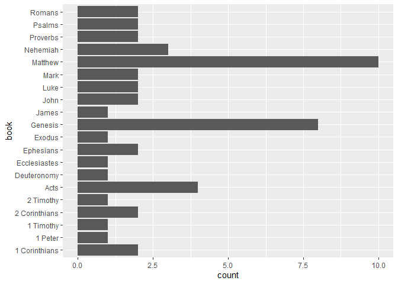
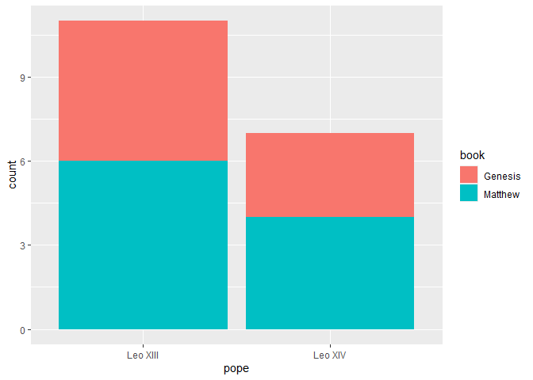
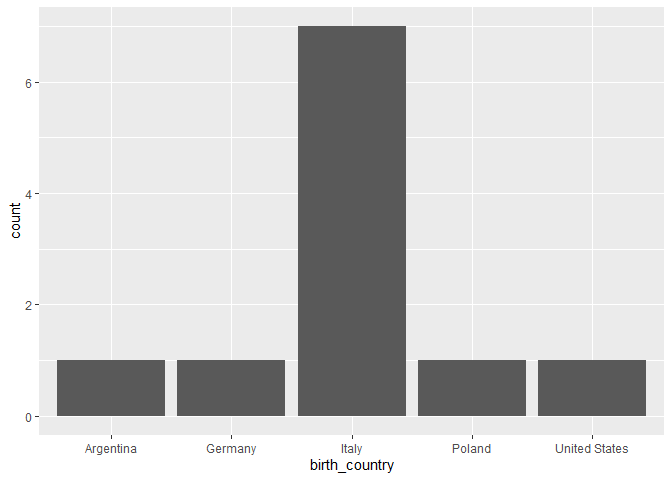
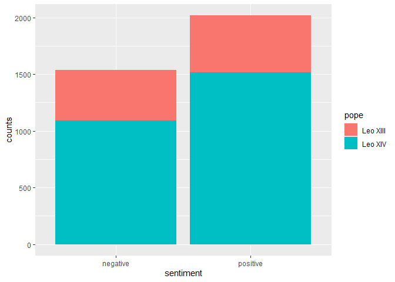

Tidy Tuesday - June 23, 2026 - Papal Encyclicals
================

## My Second Week of Tidy Tuesday Fun - Papal Encyclicals

A quick glance at the data frames shows that the data contains
interesting sayings from popes over the years. I’m excited to explore
what lies in the data

### Load the packages and the data

``` r
library(tidyverse)
library(knitr)
library(here)
library(stringr)
library(tidytext)
```

``` r
encyc <- read_csv(here("23June2026_Encyclicals","raw_encyclicals.csv"))
```

    ## Rows: 309 Columns: 7
    ## ── Column specification ────────────────────────────────────────────────────────
    ## Delimiter: ","
    ## chr (3): encyclical, pope, text
    ## dbl (4): year, paragraph, word_count, sentence_count
    ## 
    ## ℹ Use `spec()` to retrieve the full column specification for this data.
    ## ℹ Specify the column types or set `show_col_types = FALSE` to quiet this message.

``` r
papal <- read_csv(here("23June2026_Encyclicals","raw_papal.csv"))
```

    ## Rows: 213 Columns: 9
    ## ── Column specification ────────────────────────────────────────────────────────
    ## Delimiter: ","
    ## chr  (4): title, pope, birth_name, birth_country
    ## dbl  (3): year, papal_number, pontificate_year
    ## date (2): pontificate_start, pontificate_end
    ## 
    ## ℹ Use `spec()` to retrieve the full column specification for this data.
    ## ℹ Specify the column types or set `show_col_types = FALSE` to quiet this message.

``` r
scrip <- read_csv(here("23June2026_Encyclicals","raw_scripture.csv"))
```

    ## Rows: 50 Columns: 7
    ## ── Column specification ────────────────────────────────────────────────────────
    ## Delimiter: ","
    ## chr (5): encyclical, pope, reference, book, testament
    ## dbl (2): year, paragraph
    ## 
    ## ℹ Use `spec()` to retrieve the full column specification for this data.
    ## ℹ Specify the column types or set `show_col_types = FALSE` to quiet this message.

### Curious about the scripture reference dataset

``` r
# which popes are in the dataset
unique(scrip$pope)
```

    ## [1] "Leo XIII" "Leo XIV"

``` r
# what books of the Bible are referenced in the dataset
unique(scrip$book)
```

    ##  [1] "Deuteronomy"   "Genesis"       "James"         "2 Timothy"    
    ##  [5] "2 Corinthians" "Matthew"       "Luke"          "Acts"         
    ##  [9] "Mark"          "Romans"        "1 Timothy"     "Exodus"       
    ## [13] "Ecclesiastes"  "Proverbs"      "1 Corinthians" "Nehemiah"     
    ## [17] "Psalms"        "Ephesians"     "John"          "1 Peter"

``` r
# what years are in the dataset
unique(scrip$year)
```

    ## [1] 1891 2026

I’d like to know how many times each unique book is referenced.

### Plot the times each unique book of the Bible is referenced

``` r
# create a plot to show number of times books are referenced
scrip |> ggplot(aes(x = book)) + geom_bar() + coord_flip()
```

<!-- -->

So, Matthew and Genesis are the top two referenced. It’s interesting
that a Gospel and the Beginnings books are the most popular. Which of
the two unique popes, Leo XIII or Leo XIV, referenced Matthew and
Genesis more.

### Who used which book more?

``` r
# plot Matthew and Genesis by Pope
scrip |> filter(book == "Matthew" | book == "Genesis") |>  ggplot(aes(x=pope, fill = book)) + geom_bar()
```

<!-- -->

### Looking at the Encyclical dataset

``` r
# how many years in the dataset
unique(encyc$year) # only 1891 and 2026
```

    ## [1] 1891 2026

``` r
# which popes in the dataset
unique(encyc$pope) # only Leo XIII and Leo XIV
```

    ## [1] "Leo XIII" "Leo XIV"

### Looking at the Papal dataset

``` r
# how many years in the dataset
unique(papal$year)
```

    ##  [1] 1878 1879 1880 1881 1882 1883 1884 1885 1886 1887 1888 1889 1890 1891 1892
    ## [16] 1893 1894 1895 1896 1897 1898 1899 1900 1901 1902 1903 1904 1905 1906 1907
    ## [31] 1909 1910 1911 1912 1914 1917 1918 1919 1920 1921 1923 1924 1925 1926 1928
    ## [46] 1929 1930 1931 1932 1933 1935 1936 1937 1939 1940 1943 1944 1945 1946 1947
    ## [61] 1948 1949 1950 1951 1953 1954 1955 1956 1957 1958 1959 1961 1962 1963 1964
    ## [76] 1965 1966 1967 1968 1979 1980 1981 1985 1986 1987 1990 1991 1993 1995 1998
    ## [91] 2003 2005 2007 2009 2013 2015 2020 2024 2026

``` r
# which popes in the dataset
unique(papal$pope)
```

    ##  [1] "Leo XIII"     "Pius X"       "Benedict XV"  "Pius XI"      "Pius XII"    
    ##  [6] "John XXIII"   "Paul VI"      "John Paul II" "Benedict XVI" "Francis"     
    ## [11] "Leo XIV"

``` r
# which countries in the dataset
unique(papal$birth_country)
```

    ## [1] "Italy"         "Poland"        "Germany"       "Argentina"    
    ## [5] "United States"

### How many popes were born in each country represented?

``` r
# narrow down the data by pope and distinct birth_country
pope_total <- papal |> distinct(pope, birth_country)
# display the number of popes by country
pope_total |> ggplot(aes(x=birth_country)) + geom_bar()
```

<!-- -->

### Sentiment Analysis

I’m going to attempt a sentiment analysis on the Encyclical dataset.
I’ve only done it in Python, but I’m going to research “tidytext” in R.

``` r
# tokenize the text column into individual words
tokenization <- encyc |> unnest_tokens(word, text)

# remove stop words
clean_data <- tokenization |> anti_join(stop_words)
```

    ## Joining with `by = join_by(word)`

``` r
# add the sentiment to popes' words using "bing"
sentiments <- clean_data |> inner_join(get_sentiments("bing"))
```

    ## Joining with `by = join_by(word)`

``` r
# attribute to each pope his positive and negative counts
pope_sentiment <- sentiments |> group_by(pope, sentiment) |> summarize(counts = n())
```

    ## `summarise()` has regrouped the output.
    ## ℹ Summaries were computed grouped by pope and sentiment.
    ## ℹ Output is grouped by pope.
    ## ℹ Use `summarise(.groups = "drop_last")` to silence this message.
    ## ℹ Use `summarise(.by = c(pope, sentiment))` for per-operation grouping
    ##   (`?dplyr::dplyr_by`) instead.

### Sentiment Analysis Plot

``` r
# display the popes' sentiments
pope_sentiment |> ggplot(aes(x=sentiment, y=counts, fill=pope)) + geom_col()
```

<!-- -->

Pope Leo XIV has technology on his side with the ability to produce more
encyclicals than Pope Leo XIII had. Also, it appears that Pope Leo XIII
was equally encouraging and warning and in his encyclicals, while Pope
Leo XIV has been more encouraging than warning.
