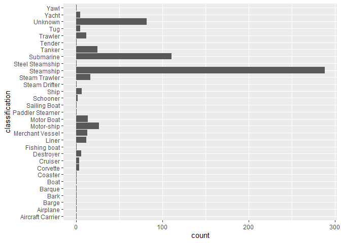
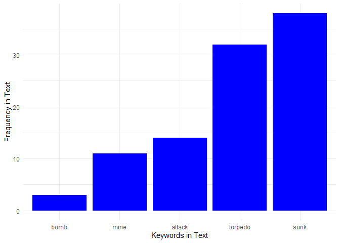

Tidy Tuesday June 30th Wreck Inventory
================

## My Third Week of Tidy Tuesday Fun

I’m still learning to use R and to work with the Tidy Tuesday data.
Let’s get started. 🏫👩💻

``` r
library(tidyverse)
```

    ## Warning: package 'tidyverse' was built under R version 4.5.3

    ## Warning: package 'ggplot2' was built under R version 4.5.3

    ## Warning: package 'readr' was built under R version 4.5.3

    ## Warning: package 'purrr' was built under R version 4.5.3

    ## Warning: package 'dplyr' was built under R version 4.5.3

    ## Warning: package 'lubridate' was built under R version 4.5.3

    ## ── Attaching core tidyverse packages ──────────────────────── tidyverse 2.0.0 ──
    ## ✔ dplyr     1.2.1     ✔ readr     2.2.0
    ## ✔ forcats   1.0.1     ✔ stringr   1.6.0
    ## ✔ ggplot2   4.0.3     ✔ tibble    3.3.1
    ## ✔ lubridate 1.9.5     ✔ tidyr     1.3.2
    ## ✔ purrr     1.2.2     
    ## ── Conflicts ────────────────────────────────────────── tidyverse_conflicts() ──
    ## ✖ dplyr::filter() masks stats::filter()
    ## ✖ dplyr::lag()    masks stats::lag()
    ## ℹ Use the conflicted package (<http://conflicted.r-lib.org/>) to force all conflicts to become errors

``` r
library(knitr)
```

    ## Warning: package 'knitr' was built under R version 4.5.3

``` r
library(here)
```

    ## Warning: package 'here' was built under R version 4.5.3

    ## here() starts at C:/Users/sulli/OneDrive/Documents/Sullivan/Natalie/R Projects/Tidy_Tuesdays

``` r
wreck_inventory <- read.csv(here("30June2026_Wreck", "raw_wreck_inventory.csv"))
```

The data looks interesting, especially with the descriptions of the
wreck. Although this data might be limited, it would be interesting to
find out how often words like “attack” or “bomb” appears in the texts.

I’d like to know the range in years first.

``` r
range(wreck_inventory$year, na.rm=TRUE) # 1306 - 2017
```

    ## [1] 1306 2017

The years are from 1306 to 2017. Let’s narrow our data down to the WWII
time frame from 1939 to 1945.

### Filter the data during WWII time frame from 1939 - 1945

``` r
wwii <- wreck_inventory |> filter(year >= 1939 & year <= 1945)
```

### Basic plots of data

Let’s see what types of vessels and how many of each in a plot.

``` r
wwii |> ggplot(aes(x=classification)) + geom_bar() + coord_flip()
```

<!-- -->

So, mostly steamships and submarines. Let’s switch it up and look at the
text data.

### Basic text data investigation (with help from Gemini)

I would like to count the words “attack,”bomb,“,”torpedo,” “mine,” and
“sunk” in the WWII data and make basic plots. Gemini is helping me
recall how to use the stringr functions and has reminded me that I
should make my table longer after I count all the instances of the words
for each row.

``` r
wwii_words <- wwii |> 
  mutate(attack = str_count(description, regex("attack", ignore_case = TRUE)),
         bomb = str_count(description, regex("bomb", ignore_case = TRUE)),
         torpedo = str_count(description, regex("torpedo", ignore_case = TRUE)),
         mine = str_count(description, regex("mine", ignore_case = TRUE)),
         sunk = str_count(description, regex("sunk", ignore_case = TRUE)))
```

Now that we have the count for each of the words, we’ll make the table
longer and plot a bar graph.

``` r
# narrow down the columns and make the data longer
wwii_counts <- wwii_words |> 
  pivot_longer(
    cols = c(attack, bomb, torpedo, mine, sunk),
    names_to = "word",
    values_to = "count"
  ) |> group_by(word) |> summarize(count = sum(count))

# create a bar graph from the word count
wwii_counts |> ggplot(aes(x = fct_reorder(word, count), y = count)) + geom_col(fill = "blue") + theme_minimal() + labs(x = "Keywords in Text", y = "Frequency in Text")
```

<!-- -->
